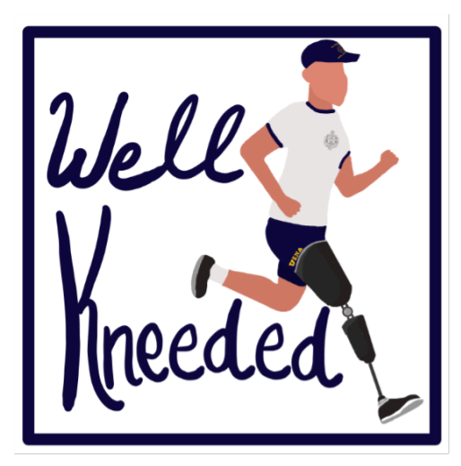

# Introduction

Welcome to the EX401: Interdisciplinary Senior Design Course.

LIMBS has developed an ultra-low-cost passive prosthetic to developing countries to help amputees regain their mobility and self-respect in these cultures. However, the current process to calibrate each knee after assembly is complex and time consuming. Often hundreds of knees are calibrated by volunteers that may have no background in prosthetics. This team has developed a calibration system that simplifies and quickens calibration through automation.
 