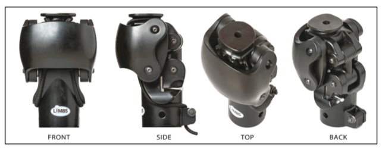

# Introduction

Welcome to the EX401: Interdisciplinary Senior Design Course.

LIMBS has developed an ultra-low-cost passive prosthetic to developing countries to help amputees regain their mobility and self-respect in these cultures. However, the current process to calibrate each knee after assembly is complex and time consuming. Often, hundreds of knees are calibrated by volunteers that may have no background in prosthetics. This team has developed a calibration system that simplifies and quickens calibration through automation.
 
 ## Overview of the Injection Molded Knee
 Designing and producing prosthetic knees involves many critical considerations, including the user’s daily functional needs, activity level, and external factors such as terrain, funding, access to electricity, proximity to medical support, and cultural values. LIMBS International addresses these challenges by developing and distributing prosthetic knee kits to clinics in developing countries. Their primary product, the LIMBS Injection Molded (IM) Knee—also known as the LIMBS M3 Knee—was developed by students at LeTourneau University and patented in 2004. It features a simple, durable, and affordable design that promotes a more natural gait and energy-efficient movement. However, it has limitations, such as incomplete extension during gait and a suboptimal locking mechanism. Before these knees are distributed, each one must undergo a manual "initial calibration" process to achieve a standard level of stiffness. To improve efficiency, Team Well Kneeded has been tasked with designing a device to automate this calibration process. Their work is informed by interviews with prosthetics experts like Dr. Galey and research into existing prosthetic technologies and testing methods.

## Proposed Solution

