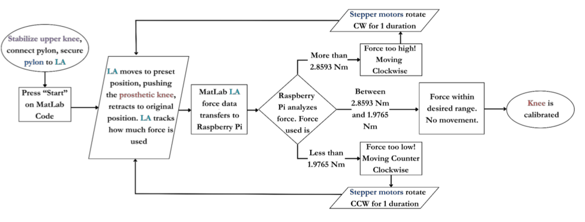

# Introduction

Welcome to the EX401: Interdisciplinary Senior Design Course.

LIMBS has developed an ultra-low-cost passive prosthetic to developing countries to help amputees regain their mobility and self-respect in these cultures. However, the current process to calibrate each knee after assembly is complex and time consuming. Often, hundreds of knees are calibrated by volunteers that may have no background in prosthetics. This team has developed a calibration system that simplifies and quickens calibration through automation.
 
 ## Overview of the Injection Molded Knee
 Designing and producing prosthetic knees involves many critical considerations, including the user’s daily functional needs, activity level, and external factors such as terrain, funding, access to electricity, proximity to medical support, and cultural values. LIMBS International addresses these challenges by developing and distributing prosthetic knee kits to clinics in developing countries. Their primary product, the LIMBS Injection Molded (IM) Knee—also known as the LIMBS M3 Knee—was developed by students at LeTourneau University and patented in 2004. It features a simple, durable, and affordable design that promotes a more natural gait and energy-efficient movement. However, it has limitations, such as incomplete extension during gait and a suboptimal locking mechanism. Before these knees are distributed, each one must undergo a manual "initial calibration" process to achieve a standard level of stiffness. To improve efficiency, Team Well Kneeded has been tasked with designing a device to automate this calibration process. Their work is informed by interviews with prosthetics experts like Dr. Galey and research into existing prosthetic technologies and testing methods.

## Proposed Solution
As a solution to the manual and time-consuming calibration process of the LIMBS IM Knee, Team Well Kneeded developed a fully integrated, semi-automated calibration device. Designed in close collaboration with LIMBS International, the final product features a durable 80/20 aluminum frame, an Iris ORCA-3 linear actuator, two NEMA-23 stepper motors, and custom SLA-printed connectors. Each component was tested to ensure structural integrity, operational accuracy, and ease of use. The device streamlines the calibration process, offering consistent and reliable stiffness adjustment for prosthetic knees prior to distribution. The full system is supported by open-source code, available via GitHub, allowing for future updates and scalability.

The flow chart describes an overview of created calibration process.

## Laptop and Raspberry Pi Pico
To enable seamless communication between the MATLAB script and the Python calibration software, the team implemented a serial connection using a Raspberry Pi Pico microcontroller. This setup allowed data to be transmitted and received reliably between the two platforms during the calibration process. The table below outlines the essential code used on each platform—MATLAB, Python, and the Raspberry Pi Pico. All source code and setup instructions are available for download through the project’s GitHub repository.

<table border="0">
 <td style="text-align: center;">
      <b style="font-size:30px">MATLAB</b> 
    </td>
    <td style="text-align: center;">
      <b style="font-size:30px">Raspberry Pi</b> 
    </td>
 <tr>
    <td> Actuator.m</td>
    <td> Pico_Screw_Motors_Class.py</td>
 </tr>
  <tr>
    <td> Final_Matlab_code.m</td>
    <td> Pico_Test_Class.py</td>
 </tr>
  <tr>
    <td> Finalcode2.m</td>
    <td> circuitpython_main_code.py</td>
 </tr>
  <tr>
    <td> idk.asv</td>
    <td> circuitpython_motor_class.py</td>
 </tr>

</table>

## About the Authors

  

#